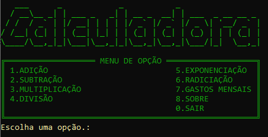
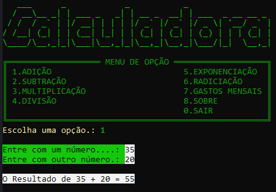
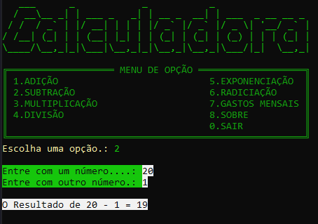
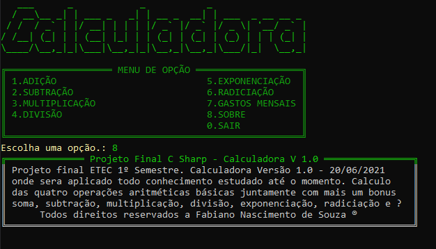

# Projeto-Final
Projeto calculadora um aplicativo desenvolvido em Csharp usando tudo que foi de conhecimento no 1º Semestre na ETEC. Sera usado as operações basicas aritiméticas com um Bônus de gastos mensais.

# Designer
  ___      _            _           _
  / __\__ _| | ___ _   _| | __ _  __| | ___  _ __ __ _ 
 / /  / _` | |/ __| | | | |/ _` |/ _` |/ _ \| '__/ _` |
/ /__| (_| | | (__| |_| | | (_| | (_| | (_) | | | (_| |
\____/\__,_|_|\___|\__,_|_|\__,_|\__,_|\___/|_|  \__,_|

╔═══════════════════ MENU DE OPÇÃO ═══════════════════╗
║ 1.ADIÇÃO                           5.EXPONENCIAÇÃO  ║
║ 2.SUBTRAÇÃO                        6.RADICIAÇÃO     ║
║ 3.MULTIPLICAÇÃO                    7.BÔNUS          ║
║ 4.DIVISÃO                          8.SOBRE          ║
║                                    0.SAIR           ║
╚═════════════════════════════════════════════════════╝

## _Screenshot_



- Adição



- Subtração



- Sobre



## _Download_

Baixe o arquivo abaixo. Descompacte na pasta deseja.

[🎁 Download do arquivo.zip](dist/Calculadora.zip)

Execute utilizando o comando:

```
dotnet Projeto-Final.dll
```
Ou, se você estiver no Windows, pode dar um  duplo -clique no icone do programa.

## Agradecimentos

- [Figgle](https://github.com/drewnoakes/figgle)
- [Etec Adolpho Berezin](http://eteab.com.br/cms/)
- [Prof. Ermogeneses](https://github.com/ermogenes/)
- [Prof. Diego Neri](https://github.com/diegoneri)
- [Dev C#](https://github.com/ermogenes/aulas-programacao-csharp)

---

Todos direitos reservados a Fabiano Nascimento de Souza ®
